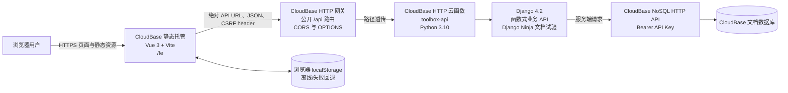
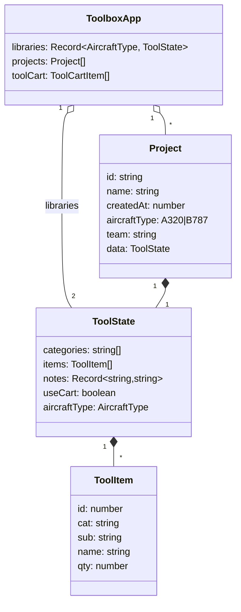
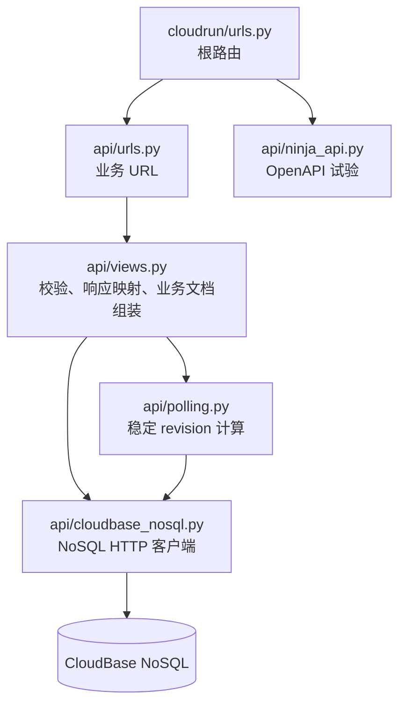
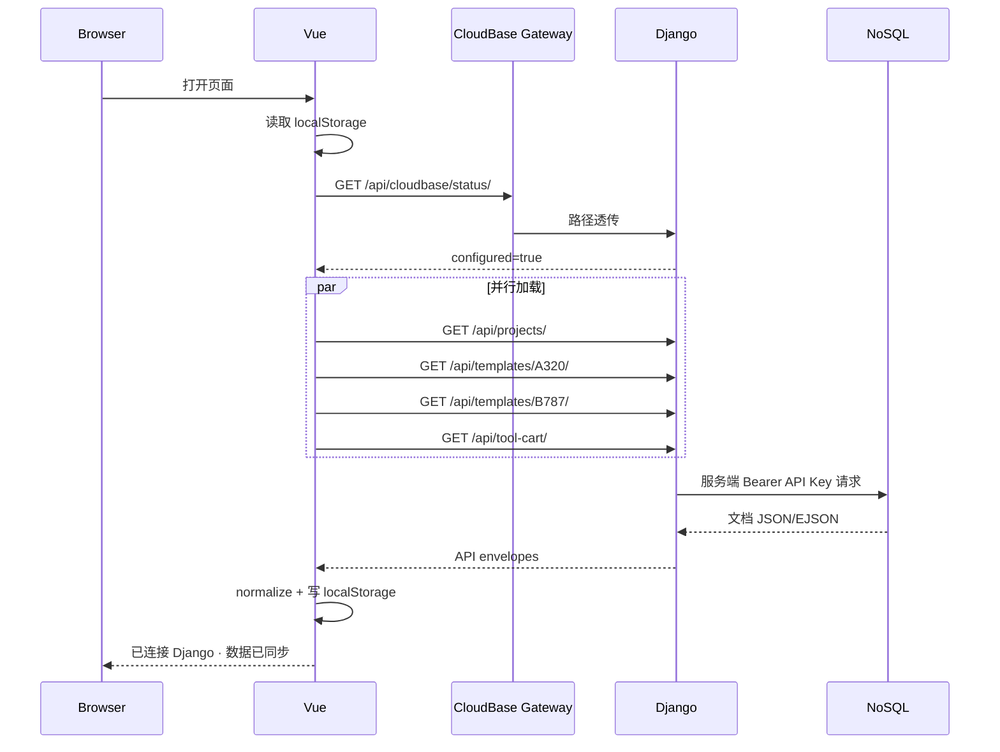
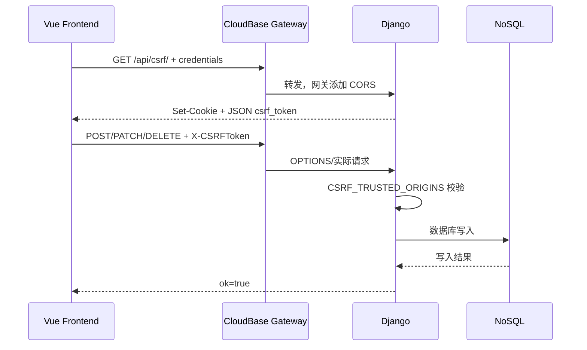
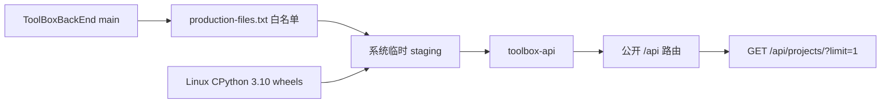

# ToolBox 系统架构

## 1. 系统定位

ToolBox 是面向飞机定检工作的工具清单管理系统。当前可用客户端为 Vue Web 管理端，微信前端子仓库处于预留状态。系统管理三类核心数据：

- 工作项目；
- A320/B787 标准工具库；
- 公共工具车。

业务数据保存于腾讯云 CloudBase 文档型 NoSQL。Django 不使用 ORM 保存业务数据；本地 SQLite 仅供 Django 框架能力使用。

## 2. 生产拓扑



### 2.1 生产地址

| 用途 | 地址 |
|---|---|
| 推荐 Web 地址 | <https://fe-da-tool-list-d2g0awsejc0658949.webapps.tcloudbase.com/> |
| 原始静态托管地址 | <https://da-tool-list-d2g0awsejc0658949-1464163374.tcloudbaseapp.com/fe/> |
| API 根地址 | <https://da-tool-list-d2g0awsejc0658949-1464163374.ap-shanghai.app.tcloudbase.com/api> |
| Swagger 试验页 | <https://da-tool-list-d2g0awsejc0658949-1464163374.ap-shanghai.app.tcloudbase.com/api/docs> |
| OpenAPI Schema | <https://da-tool-list-d2g0awsejc0658949-1464163374.ap-shanghai.app.tcloudbase.com/api/openapi.json> |

静态独立域名的 `/` 被 CloudBase 重写到静态存储前缀 `/fe`。Vite 使用相对资源地址，因此推荐域名和原始 `/fe/` 地址都能正确加载资源。

## 3. 仓库结构

父仓库通过 Git submodule 管理三个独立仓库：

```text
ToolBox/
├── package.json                 # 根目录 npm run dev
├── start-dev.ps1                # 同时管理 Django 与 Vite
├── docs/                        # 系统与运维文档
├── ToolBoxBackEnd/              # Django 后端子仓库
├── ToolBoxWebFrontEnd/           # Vue Web 管理端子仓库
└── ToolBoxWeiXinFrontEnd/        # 微信前端预留子仓库
```

父仓库只记录子仓库 commit 指针。提交跨仓库修改时必须先提交子仓库，再提交父仓库 gitlink。

## 4. Web 前端架构

### 4.1 技术栈

- Vue 3；
- TypeScript；
- Vite 7；
- `xlsx`：表格导入导出；
- `html2canvas`：页面图片导出。

### 4.2 模块划分

| 模块 | 职责 |
|---|---|
| `src/App.vue` | 页面装配与主视图切换 |
| `src/components/` | 项目列表、项目详情、分类、物品、工具车等界面 |
| `src/composables/useToolbox.ts` | 业务状态、远端加载、延迟保存、本地缓存和 UI 操作 |
| `src/domain/toolbox.ts` | TypeScript 类型、数据清洗、前后端结构转换 |
| `src/api.ts` | API 根地址、CSRF、Fetch 封装、错误映射 |
| `src/services/spreadsheet.ts` | Excel 导入导出 |
| `src/services/sharing.ts` | 分享数据编码与解析 |
| `src/utils/format.ts` | 日期与显示格式化 |

### 4.3 前端状态模型



前端编辑时使用扁平 `ToolItem[]`；发送后端前转换为 `sections -> works -> items` 嵌套结构。所有远端、导入和本地缓存数据都先经过 normalize 函数清洗。

### 4.4 加载与保存策略

启动时：

1. 立即从 `localStorage` 加载 `categoryItemManager.v2`，保证页面可用；
2. 请求后端状态；
3. 并行读取项目、A320、B787 和工具车；
4. 远端成功后覆盖内存与本地缓存；
5. 失败时保留本地缓存并显示“后端连接失败”。

编辑时：

- 先同步写入 `localStorage`；
- 450 ms 防抖后写远端；
- 同一时刻只执行一次远端保存，期间的新变更通过 `remotePending` 合并为下一轮；
- 远端失败不会丢弃本地缓存。

当前前端没有调用 `/api/poll/`。该接口已经由后端实现，属于未来多客户端同步的预留能力。

## 5. 后端架构

### 5.1 分层



旧业务 URL 必须排在 Ninja URL 前面，避免 Ninja 截获未匹配的 `/api/*`。

### 5.2 API

| 方法 | 路径 | 功能 |
|---|---|---|
| GET | `/` | 后端健康信息 |
| GET | `/api/csrf/` | 设置 CSRF Cookie，并在 JSON 中返回 CSRF token |
| GET | `/api/cloudbase/status/` | 检查 CloudBase 配置，不返回秘密值 |
| GET | `/api/poll/` | 返回业务数据 revision 和变化标记 |
| GET, POST | `/api/projects/` | 查询、创建项目 |
| GET, PATCH, DELETE | `/api/projects/{id}/` | 读取、更新、删除项目 |
| GET, PUT | `/api/templates/{aircraft_type}/` | 读取、保存 A320/B787 标准库 |
| GET, PUT | `/api/tool-cart/` | 读取、保存工具车 |
| GET | `/api/docs` | Django Ninja Swagger 试验页 |
| GET | `/api/openapi.json` | Ninja 演示接口 OpenAPI Schema |
| GET | `/api/hello` | 类型化查询参数演示 |
| POST | `/api/project-preview` | 类型化请求体校验演示，不写数据库 |

旧业务接口目前仍是 Django 函数视图，没有出现在 Ninja OpenAPI 中。

### 5.3 错误映射

- 配置缺失：503；
- CloudBase HTTP 错误：尽量保留 4xx/5xx 状态和 `details`；
- CloudBase 不可达：502；
- JSON 或业务参数错误：400；
- 未支持的机型：404 或 400，取决于操作类型。

由于数据库“集合不存在”也会返回 404，排查时应阅读响应 JSON，而不是仅凭 Django 的 `Not Found` 日志判断 URL 问题。

## 6. 数据层

### 6.1 集合

| 集合 | 文档 ID | 内容 |
|---|---|---|
| `work_projects` | 后端生成 UUID hex | 工作项目 |
| `aircraft_templates` | `A320`、`B787` | 标准库 |
| `tool_cart` | `default` | 公共工具车 |

可通过 `CLOUDBASE_COLLECTION_PREFIX` 切换到其他集合，例如 `test_work_projects`。使用前必须在 CloudBase 创建对应集合。

### 6.2 项目文档

```json
{
  "_id": "uuid-hex",
  "name": "项目名称",
  "aircraft_type": "A320",
  "team": "A1",
  "sections": [
    {
      "name": "部位",
      "notes": "备注",
      "works": [
        {
          "name": "工作项",
          "items": [
            { "name": "工具", "quantity": 2 }
          ]
        }
      ]
    }
  ],
  "use_tool_cart": false,
  "created_at": "ISO-8601",
  "updated_at": "ISO-8601",
  "version": 1
}
```

项目更新时后端通过 `$inc` 原子递增 `version`。

### 6.3 NoSQL 访问

Django 使用服务端 API Key 调用：

```text
https://{env_id}.api.tcloudbasegateway.com/v1/database/
  instances/{instance}/databases/{database}/collections/{collection}/documents
```

客户端封装支持 list、insert、get、update/upsert、delete，并把 CloudBase Strict EJSON 转换为普通 JSON。API Key 只存在本地 `.env` 和云函数环境变量，绝不能进入浏览器构建产物或 Git。

## 7. 关键请求流程

### 7.1 页面初始化



### 7.2 跨 Origin 写入



## 8. 本地开发

父仓库根目录执行：

```powershell
npm run dev
```

启动内容：

- Django：<http://127.0.0.1:8000/>
- Vite：<http://127.0.0.1:5173/>
- Vite 将 `/api` 代理到 Django。

根脚本检查：

- `ToolBoxBackEnd/.venv/Scripts/python.exe`；
- `npm.cmd`；
- `ToolBoxWebFrontEnd/node_modules`。

脚本默认使用无前缀集合。要使用隔离集合，显式传入前缀，并预先创建集合。

## 9. 生产发布架构

### 9.1 后端



命令：

```powershell
cd ToolBoxBackEnd
.\scripts\deploy-production.ps1          # 只读预检
.\scripts\deploy-production.ps1 -Deploy  # 正式发布
```

部署脚本：

1. 只从 Git `main` 打包白名单文件；
2. 检查 `scf_bootstrap` 为 LF；
3. 下载 Linux CPython 3.10 wheels 到函数包；
4. 校验 CloudBase 登录环境；
5. 创建或更新 `toolbox-api`；
6. 合并并设置云端环境变量；
7. 等待函数 `Active/Available`；
8. 创建或校验公开 `/api` 路由；
9. 通过公开 URL 读取真实 NoSQL 冒烟。

### 9.2 前端

```powershell
cd ToolBoxWebFrontEnd
npm run check
```

`npm run check` 依次执行 TypeScript 检查和 Vite build。`dist/` 上传到 CloudBase 静态托管 `fe` 前缀。生产构建参数：

- `base: "./"`；
- `VITE_API_BASE_URL` 指向生产 HTTP 网关；
- `dist/` 不进入 Git。

## 10. 配置与秘密边界

| 配置 | 位置 | 是否可公开 |
|---|---|---|
| `VITE_API_BASE_URL` | 前端 `.env.production` | 是，最终会进入 JS |
| `CLOUDBASE_ENV_ID` | 后端 `.env` / 云函数环境变量 | 环境 ID 可公开，但仍不必散布 |
| `CLOUDBASE_API_KEY` | 后端 `.env` / 云函数环境变量 | 否 |
| `DJANGO_SECRET_KEY` | 云函数环境变量 | 否 |
| `CSRF_TRUSTED_ORIGINS` | 云函数环境变量 | 是 |
| `CLOUDBASE_COLLECTION_PREFIX` | 本地进程环境 | 是 |

`.env` 被 Git 忽略。部署脚本首次需要时会生成稳定的生产 Django Secret，并保存在被忽略的后端 `.env` 中。

## 11. 安全与可靠性现状

已实现：

- API Key 只在服务端；
- CSRF token 与可信 Origin 校验；
- CloudBase 网关 CORS；
- 输入范围和机型校验；
- 生产文件白名单；
- 部署后数据库冒烟；
- 本地缓存降级；
- 测试和类型检查。

尚未实现：

- 用户登录和授权；
- 团队级数据隔离；
- API 速率限制；
- 完整审计日志；
- 部署自动回滚；
- 前端接入 revision 轮询；
- 数据库请求连接池与性能优化；
- 多用户并发编辑冲突处理。

在引入真实多人业务数据前，身份认证与授权应视为最高优先级。
